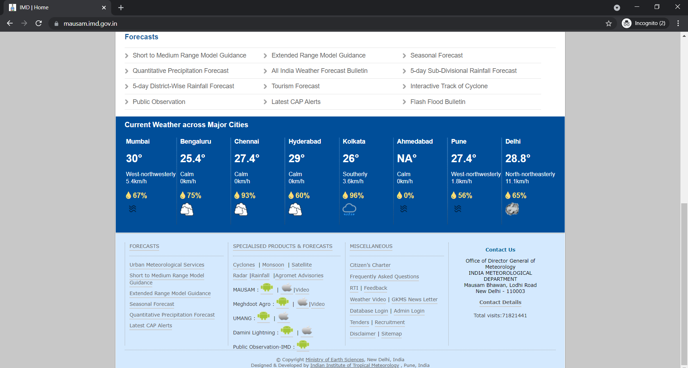
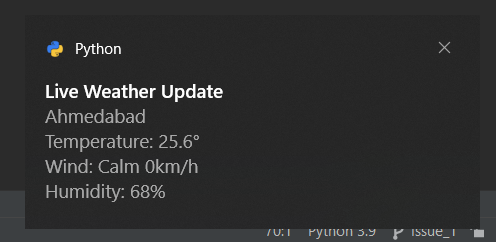
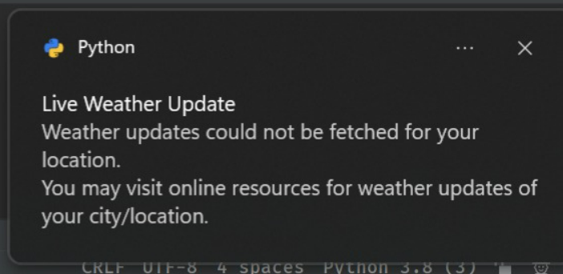

## Weather Desktop Notifier

This python script will scrap the weather data including temperature, wind, and humidity from the government's weather forecast website and will display this information as a desktop notification.

Website url: https://mausam.imd.gov.in/

### Points to be noted

- This script will show the weather information based on the user's device location. For example, if the user's device executes this program in Bengaluru city, then the weather information will be shown for Bengaluru city.

- Once the user executes this program, it will keep on executing until the user quits the program himself. This is done so that the user gets notified every 2 hours.

- The weather information is currently limited to the following cities only.

  - Mumbai
  - Bengaluru
  - Chennai
  - Hyderabad
  - Kolkata
  - Ahmedabad
  - Pune
  - Delhi

- Running this program again and again may cause error because the number of requests that can be made on the website in a given period of time is limited.

- This project will run on Windows 10.

## Instructions to execute

1. Install Python 3.x
2. Install necessary packages using the command `pip install -r requirements.txt`.
3. Open cmd in the location of the python file.
4. Execute using the command `python weather_desktop_notifier.py`.

### Snapshots for reference

- Website (Major cities).

  
- Weather information for location included in major cities (Ahmedabad).

  

- No weather information for locations other than major cities.

